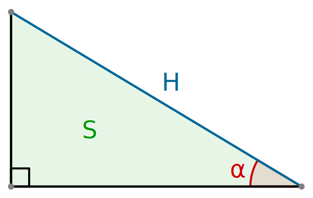

# Угол треугольника

У прямоугольного треугольника известны его гипотенуза $H$ и площадь $S$. Необходимо найти меньший из его острых углов $\alpha$ (в градусах, с точностью до 6 знаков после запятой).



## Формат ввода
В первой строке дано натуральное число $Q$ $(1 \leq Q \leq 10^{5})$ ­— число запросов подсчета угла в треугольнике.

В $N$ следующих строках идут по два вещественных числа $H_{i}$, $S_{i}$ $(0 < H_{i} \leq 4 \times 10^{4}, 0 < S_{i} \leq 10^{7})$ — гипотенуза и площадь $i$-го треугольника

## Формат вывода
Выведите $Q$ вещественных чисел — в $i$-й строке ответ на $i$-й запрос.

## Пример
### Ввод
```
2
4.0 2.0
6.9 4.2
```

### Вывод
```
15.0
10.331388491890152
```
