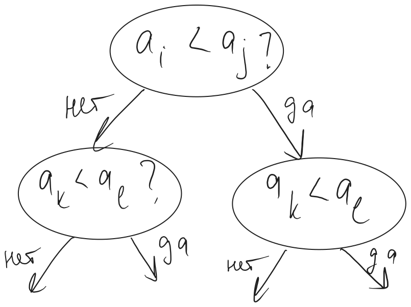
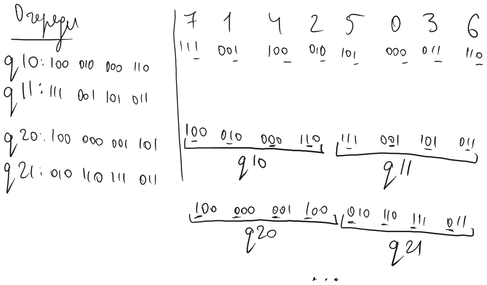

# Сортировки

Это поиск такой $\sigma \in S_{n}$, что $a_{\sigma(1)} \leq a_{\sigma(2)} \leq \textellipsis \leq a_{\sigma(n)}$

#### Теорема
Сортировка, основанная на сравнениях, работает за $\Upomega(n \log n)$



- В листьях дерева должны быть все перестановки, которых $n!$, поэтому глубина дерева $h \geq \lceil log_{2} n! \rceil \geq log_{2} n! = \Theta(n \log n)$ ([почему так](./Вбросы.md#1))
- Глубина дерева - число сравнений, которые надо сделать $\Rightarrow$ сложность $= \Upomega(n \log n)$

## Merge sort
Даны отсортированные массивы $\set{a_{n}}$ и $\set{b_{n}}$: надо объединить их в один отсортированный массив
- По 1 индексу на каждом массиве
- Сравниваем элементы под индексами
- Вписываем в новый массив меньший
- Двигаем соответствующий индекс

$O(n \log n)$

```java
public static int[] merge(int[] a, int[] b) {
    int[] result = new int[a.length + b.length];

    int aIndex = 0;
    int bIndex = 0;

    while (aIndex < a.length && bIndex < b.length) {
        // result[aIndex + bIndex] = a[aIndex] < b[bIndex] ? a[aIndex++] : b[bIndex++];

        if (a[aIndex] < b[bIndex]) {
            result[aIndex + bIndex] = a[aIndex++];
        } else {
            result[aIndex + bIndex] = b[bIndex++];
        }
    }

    while (aIndex < a.length) {
        result[aIndex + bIndex] = a[aIndex++];
    }
    while (bIndex < b.length) {
        result[aIndex + bIndex] = b[bIndex++];
    }

    return result;
}

public static int[] mergeSort(int[] array) {
    if (array.length == 1) {
        return array;
    }

    int middleIndex = array.length / 2;

    int[] left = mergeSort(Arrays.copyOfRange(array, 0, middleIndex));
    int[] right = mergeSort(Arrays.copyOfRange(array, middleIndex, array.length));

    return merge(left, right);
}
```

## Binary heap

### Heapify
За $O(1)$ дополнительно памяти и $O(n)$ времени

```java
for (int i = n / 2; i >= 0; i--) {
    heap.siftDown(i);
}
```

## Radix sort

### Бинарная


### Пошире
Можно сделать больше очередей, например, сравнивать последний байт числа и 256 очередей

```java
public static final int queueCount = 256;
public static final int integerByteCount = 4;
public static final int byteBitCount = 8;
public static final int fullByte = 0xff;

public static void radixSort(int[] array) {
    List<Queue<Integer>> queues = new ArrayList<>();
    for (int i = 0; i < queueCount; i++) {
        queues.add(new LinkedList<>());
    }

    for (int byteIndex = 0; byteIndex < integerByteCount; byteIndex++) {
        for (int element : array) {
            int neededByte = (element >> (byteBitCount * byteIndex)) & fullByte;
            queues.get(neededByte).add(element);
        }

        int globalIndex = 0;
        for (Queue<Integer> queue : queues) {
            while (!queue.isEmpty()) {
                array[globalIndex] = queue.remove();
                globalIndex++;
            }
        }
    }

    int newStartIndex = 0;
    while (array[newStartIndex] >= 0) {
        newStartIndex++;
    }

    cyclicShift(array, array.length - newStartIndex);
}

public static void cyclicShift(int[] array, int amount) {
    reverseArrayPart(array, 0, array.length - amount - 1);
    reverseArrayPart(array, array.length - amount, array.length - 1);
    reverseArrayPart(array, 0, array.length - 1);
}

public static void reverseArrayPart(int[] array, int startIndex, int endIndex) {
    for (int i = startIndex, j = endIndex; i < j; i++, j--) {
        int temp = array[i];
        array[i] = array[j];
        array[j] = temp;
    }
}
```
