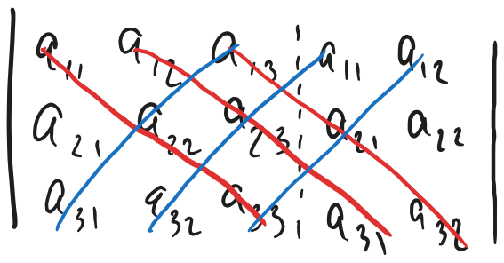

# Матрицы

## Обозначения

Заглавные латинские буквы: A, B, ...

## Определения

**Матрица** - упорядоченный набор m\*n чисел, записываемый в виде таблицы

**Нулевая** - все элементы равны нулю

**Квадратная** - M = N  
**Диагональная** - *квадратная*, у которой все элементы, помимо элементов диагонали, равны нулю  
**Единичная** - *диагональная* с единицами на диагонали

**Симметричная** - *квадратная*, у которой элементы, симметричные относительно главной диагонали, равны  
**Кососимметричная** - *квадратная*, у которой элементы, симметричные относительно главной диагонали, противоположны по знаку
- на диагонали могут стоять только нули

## Операции

### Равенство
Матрицы A и B равны, если их размеры и соответствующие элементы равны

### Сложение
$A + B = C$ <=> $c_{ij} = a_{ij} + b_{ij}$

### Транспонирование
$B_{n \times m} = {A_{m \times n}}^T$

### Умножение
$A \times B = C$ <=> $c_{ij} = \sum\limits_{k=1}^{n}{a_{ik}b_{kj}}$

$\exists AB \nRightarrow \exists BA$  
Если $AB = BA$, то $A$ и $B$ - **перестановочные**

## Определитель

#### ТОЛЬКО ОТ КВАДРАТНОЙ МАТРИЦЫ (n\*n)

**N-ного порядка** - определитель матрицы размера 3\*3  
$\det A = |A|$
### Разложение по горизонтали (первой)
$$
\begin{vmatrix}
a_{11} a_{12} a_{13} \\ a_{21} a_{22} a_{23} \\ a_{31} a_{32} a_{33}
\end{vmatrix}
\space \space \space = \space \space \space
a_{11} \times (-1)^{1+1} \times
\begin{vmatrix}
a_{22} a_{23} \\ a_{32} a_{33}
\end{vmatrix}
\space \space \space + \space \space \space
a_{12} \times (-1)^{1+2} \times
\begin{vmatrix}
a_{21} a_{23} \\ a_{31} a_{33}
\end{vmatrix}
\space \space \space + \space \space \space
a_{12} \times (-1)^{1+3} \times
\begin{vmatrix}
a_{21} a_{22} \\ a_{31} a_{32}
\end{vmatrix}
\space \space \space = \space \space \space
a_{11}a_{22}a_{33} + a_{12}a_{23}a_{31} + a_{13}a_{21}a_{32} - a_{11}a_{23}a_{32} - a_{12}a_{21}a_{33} - a_{13}a_{22}a_{31}
$$

$A_{ij} = (-1)^{i+j} \times M_{ij}$, где $M_{ij}$ - **минор** матрицы $A$ - та же матрица, но без i-той строки и j-того столбца

#### Как легко запомнить (для 2 и 3 порядка)

### Свойства
- Если в матрице есть строка/столбец/диагональ их нулей, то определитель равен нулю
- Если поменять две строки местами, определитель поменяет знаку
- Если любую строку матрицы умножить на k, то определитель умножится на k
- Если матрицу n\*n умножить на k, то определитель умножится на kn
- $(A \times B)^{T}= B^{T} \times A^T$
- $(AB)C = A(BC)$
    - Пусть $A_{m \times n}, B_{n \times p}, C_{p \times q}$
    - *Равенство размеров*
        - $((AB)_{m \times p} \times C_{p \times q})_{m \times q}$
        - $(A_{m \times n} \times (BC)_{n \times q})_{m \times q}$
    - *Равенство элементов*
        - $(AB)_{ij} = \sum\limits_{k=1}^{n} a_{ik}b_{ij}$
        - $((AB)C)_{il} = \sum\limits_{j=1}^{p} (AB)_{ij}c_{jl} = \sum\limits_{j=1}^{p}(\sum\limits_{k=1}^{n} a_{ik}b_{kj})c_{jl} = \sum\limits_{k=1}^{n} \sum\limits_{j=1}^{p} a_{ik}b_{kj}c_{jl} = \sum\limits_{k=1}^{n} a_{ik} \underset{(BC)_{kl}}{\boxed{\sum\limits_{j=1}^{p} b_{kj}c_{jl}}} = (A(BC))_{il}$

## Системы линейных уравнений

**Однородная** - все свободные члены равны 0  
**Совместная** - имеет хотя бы одно решение

### Теорема
*Однородные системы всегда совместны*  
(Всегда есть тривиальное решение - $x_{1} = 0, \space x_{2} = 0, \space ..., \space x_{n} = 0$)

### Теорема (правило Крамера)
**Критерий, что у системы (m = n) имеется ровно одно решение**  
*Тогда и только тогда, когда определитель матрицы системы отличен от нуля*

Причем:  
$X_{i} = \frac{\Delta_{i}}{\Delta}$  
где:  
$\Delta = \det A$  
$\Delta_{i}= \det A$, но в i-й столбец A подставили вектор свободных членов уравнений

- Если все $\Delta_{i} = 0$, то система имеет не единственное решение
- Если хотя бы одно $\Delta_{i} \ne 0$, система не является совместной
