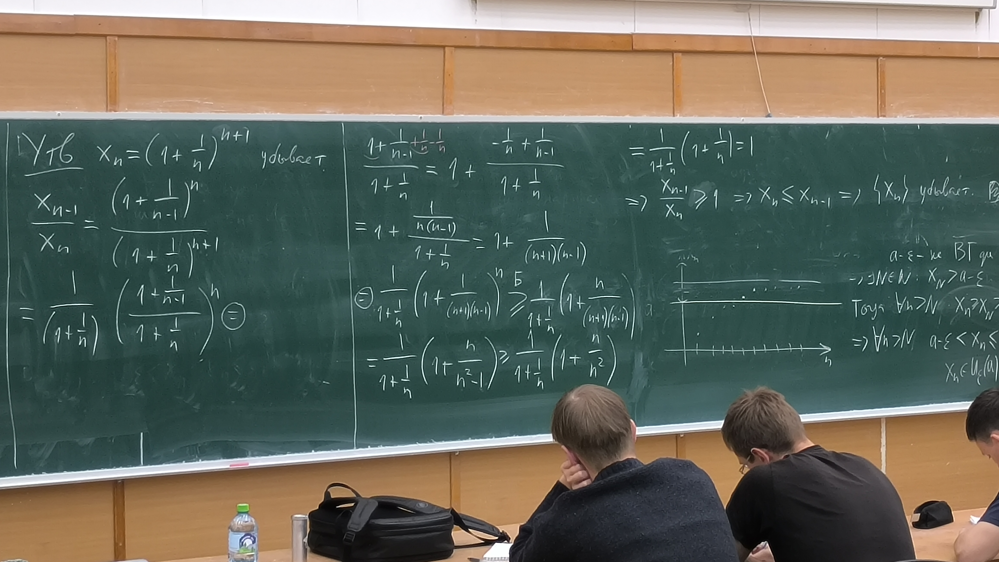

# Предел последовательности

## Числовая последовательность
Отображение $x: \mathbb{N} \rightarrow \mathbb{R}$ называется **числовой последовательностью**  
$x_{n} = x(n)$ - $n$-й элемент

### Расширенное множество вещественных чисел
$\overline{\mathbb{R}} := \mathbb{R} \cup \set{+\infty} \cup \set{-\infty}$

## Предел последовательности
$a \in \overline{\mathbb{R}}$ называется **пределом** $\set{x_{n}}$ ($x \rightarrow a, n \rightarrow \infty$), если  
$\forall \varepsilon > 0 \enspace \exists N \enspace \forall n > N \enspace |x_{n}| - a < \varepsilon$

#### Единственность предела
Если $a$ и $b$ - пределы $\set{x_{n}}$, то $a = b$

- $|a - b| = |a - x_{n} + x_{n} - b| \leq |a - x_{n}| + |x_{n} - b| < 2 \varepsilon$ (последний переход - при $n > \max(N_{1}, N_{2})$)
- $\forall \varepsilon > 0$
    - $\exists N_{1}: \enspace \forall n > N_{1} \enspace |a - x_{n}| < \varepsilon$
    - $\exists N_{2}: \enspace \forall n > N_{2} \enspace |x_{n} - b| < \varepsilon$
- Если $x \geq 0$ и $\forall \varepsilon > 0 \enspace x < \varepsilon$, то $x = 0$

## Ограниченная последовательность
$\set{x_{n}}$ ограничена, если $\exists C > 0: \enspace \forall n \in \mathbb{N} |x_{n}| < C$

### Утверждение 1
*Если $\set{x_{n}}$ сходится, то она ограничена*

- $\exists a \in \mathbb{R}: \enspace x_{n} \rightarrow a \enspace \Rightarrow \enspace \forall \varepsilon > 0 \exists N: \enspace \forall n > N \enspace |x_{n} - a| < \varepsilon$
- При $n > N$
    - $|x_{n}| = |x_{n} - a + a| \leq |x_{n} - a| + |a| < \varepsilon + |a|$
- Тогда возьмем $C := \max(|x_{1}|, |x_{2}|, \textellipsis, |x_{n}|, \varepsilon + |a|)$
- При $n \leq N \enspace |x_{n}| \leq C$

#### Утверждение 2
Если $A \subset \mathbb{R}$ конечно (и $A \ne \varnothing$), то $\exists \max A$

## Предел последовательности
Пусть $A \in \overline{\mathbb{R}} = \mathbb{R} \cup \set{-\infty} \cup \set{+\infty}$  
$U_{\varepsilon}(A) = \left\lbrace \begin{lgathered} (\frac{1}{\varepsilon}, +\infty), A = +\infty \\ (A - \varepsilon, A + \varepsilon), A \in \mathbb{R} \\ (-\infty, \frac{-1}{\varepsilon}), A = -\infty \end{lgathered} \right.$

### Определение
$\lim\limits_{n \rightarrow \infty} x_{n} = A \Leftrightarrow \forall \varepsilon > 0 \enspace \exists N \in \mathbb{N} \enspace \forall n \in \mathbb{N}: n > N \enspace x_{n} \in U_{\varepsilon}(A)$

#### Утверждение
*Равносильно определению предела*

Следующие свойства равносильны:
1. $x_{n} \rightarrow A, n \rightarrow \infty$
2. $\forall \varepsilon > 0$ вне $U_{\varepsilon}(A)$ лежит лишь конечное число элементов $\set{x_{n}}$, то есть множеств $\set{n \in \mathbb{N} \enspace \vert \enspace x_{n} \notin U_{\varepsilon}(A)}$ конечно
3. два случая:
    1. при $A \in \mathbb{R} \enspace \forall u, v \in \mathbb{R}: u < A < v \enspace \exists N \enspace \forall n > N \enspace u < x_{n} < v$
    2. при $A = +\infty \enspace \forall n > 0 \enspace \exists N \enspace \forall n > N \enspace u < x_{n}$

#### Предельный переход в неравенстве
Пусть $\forall n \in \mathbb{N} \enspace x_{n} \leq y_{n}$ и $x_{n} \rightarrow A \in \overline{\mathbb{R}}, y_{n} \rightarrow B \in \overline{\mathbb{R}}$ при $n \rightarrow \infty$  
Тогда $A \leq B$

- Рассмотрим случай $A, B \in \mathbb{R}$ - *от противного*
    - Пусть $A > B$
    - Тогда $\exists \varepsilon > 0: U_{\varepsilon}(B)$ лежит строго слева от $U_{\varepsilon}(A)$
    - Действительно, при $\varepsilon = \frac{A - B}{2}$
    - Тогда $\forall x \in U_{\varepsilon}(B) \enspace \forall y \in U_{\varepsilon}(A)$
        - $x < B + \varepsilon = B + \frac{A - B}{2} = \frac{A + B}{2}$
        - $y > A - \varepsilon = A - \frac{A - B}{2} = \frac{A + B}{2}$
        - $x < \frac{A + B}{2} < y \Rightarrow x < y$
        - $\Rightarrow U_{\varepsilon}(B)$ лежит строго слева от $U_{\varepsilon}(A)$
    - По определению предела:
        - $\exists N_{1}: \forall n > N \enspace x_{n} \in U_{\varepsilon}(A)$
        - $\exists N_{2}: \forall n > N_{2} \enspace y_{n} \in U_{\varepsilon}(B)$
    - Тогда при $n > \max(N_{1}, N_{2}) \enspace x_{n} \in U_{\varepsilon}(A), y_{n} \in U_{\varepsilon}(B)$
    - $U_{\varepsilon}(B)$ лежит строго слева от $U_{\varepsilon}(A)$
    - $\Rightarrow y_{n} < x_{n}$
        - *противоречие тому, что $x_{n} \leq y_{n}$*

#### Лемма о двух милиционерах
Пусть $\forall n \in \mathbb{N} \enspace x_{n} \leq y_{n} \leq z_{n}$  
Если $x_{n} \rightarrow A \in \overline{\mathbb{R}} и z_{n} \rightarrow A$ при $n \rightarrow \infty$,  
То $y_{n} \rightarrow A, n \rightarrow \infty$

#### Теорема Вейерштрасса
Если $\set{x_{n}}$ возрастает и ограничена сверху, то она сходится

- Рассмотрим $A = \set{x_{n} \enspace \vert \enspace n \in \mathbb{N}}$ - ограничено сверху, непусто
- $\Rightarrow$ по теореме о ТВГ $a = \sup A \in \mathbb{R}$
    - То есть $\forall \varepsilon > 0 \enspace a - \varepsilon$ - не ВГ $A$
- $\Rightarrow \exists N \in \mathbb{N}: x_{N} > a - \varepsilon$
- Тогда $\forall n > N \enspace x_{n} \geq x_{N} > a - \varepsilon$
- $\Rightarrow \forall n > N \enspace a - \varepsilon < x_{n} \leq a \Rightarrow x_{n} \in U_{\varepsilon}(a)$

#### Неравенство Бернулли
Пусть $x \geq -1, n \in \mathbb{N}$  
Тогда $(1 + x)^{n} \geq 1 + nx$

- *По индукции...*

#### Утверждение
$x_{n} = (1 + \frac{1}{n})^{n + 1}$ убывает

